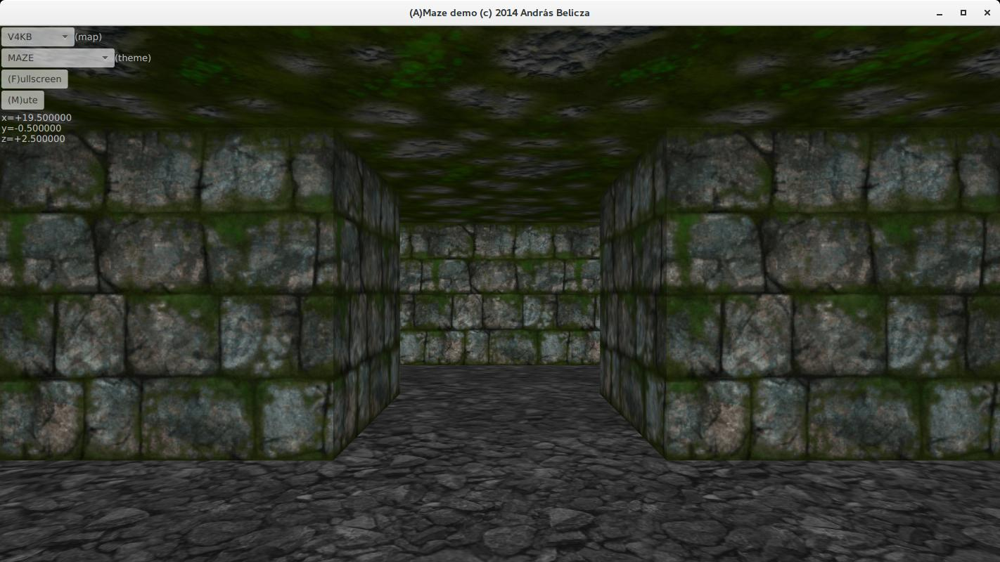
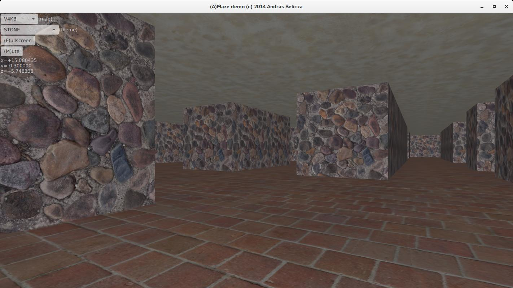
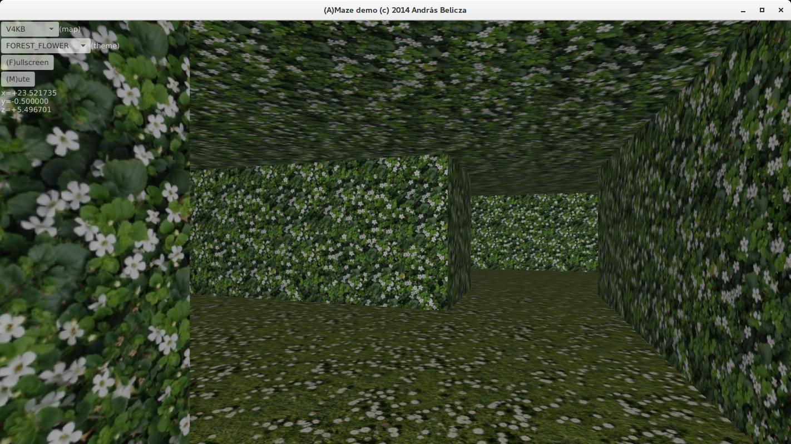
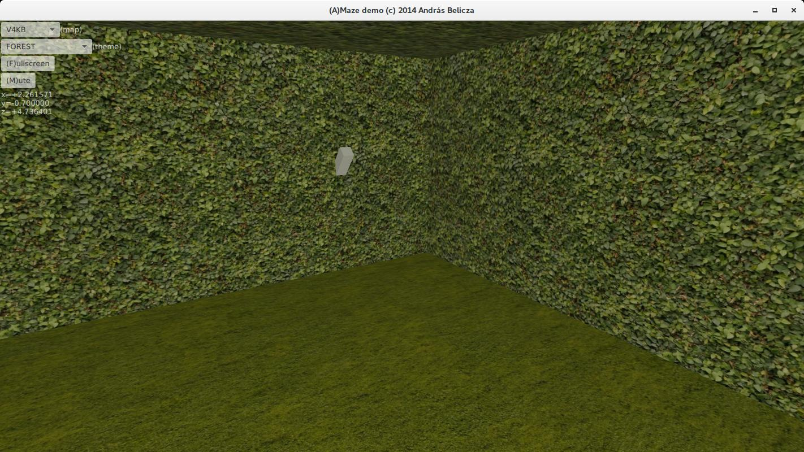
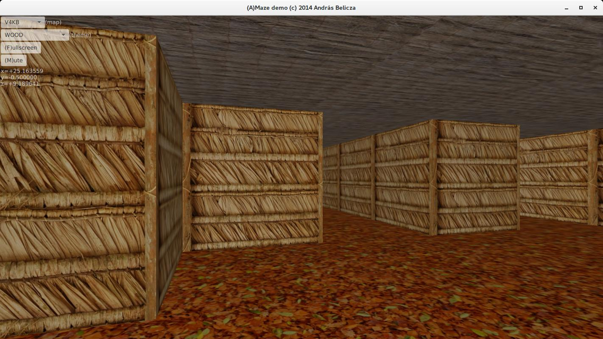
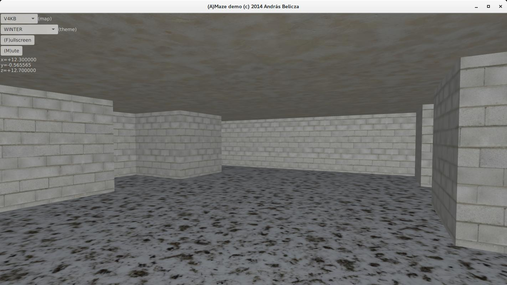
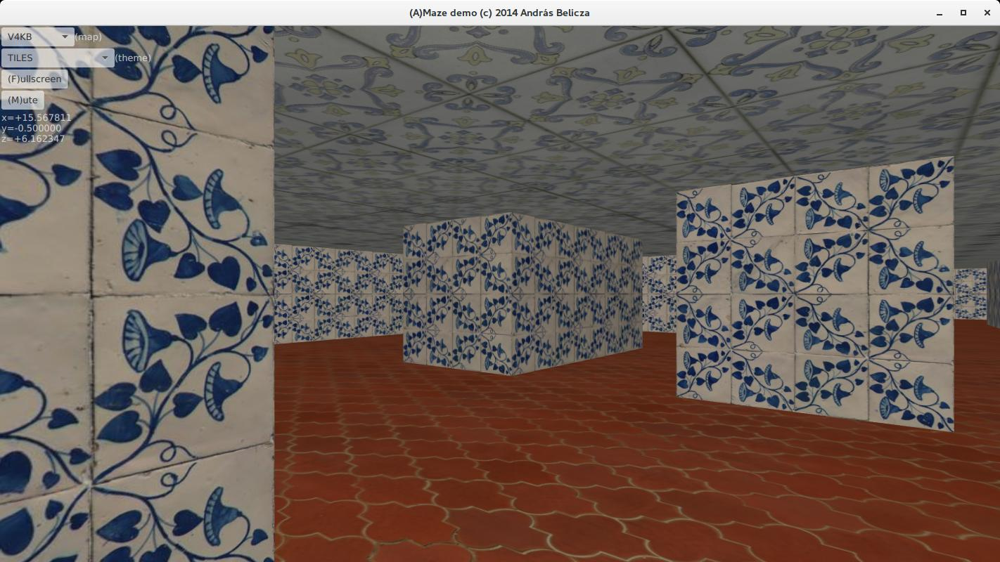
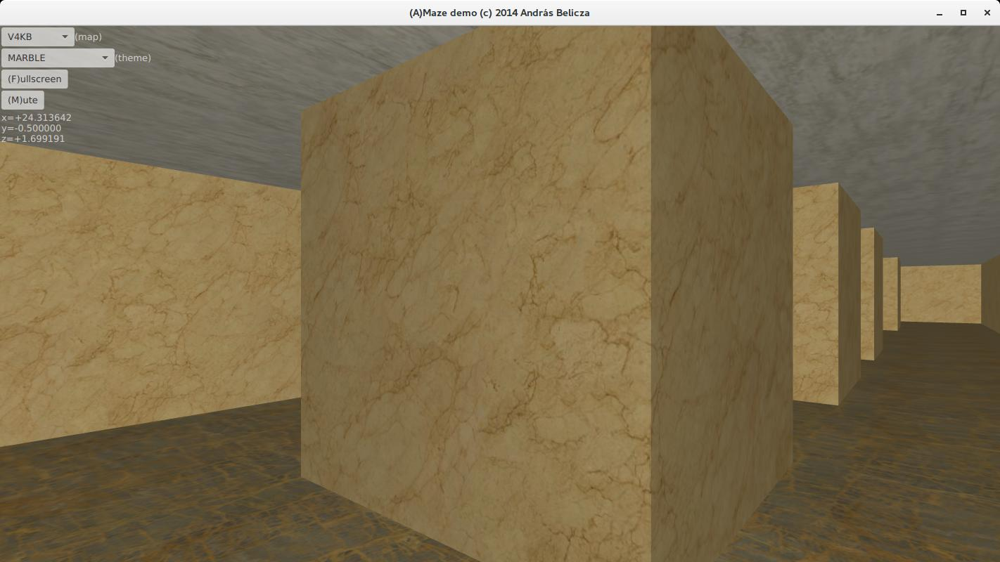
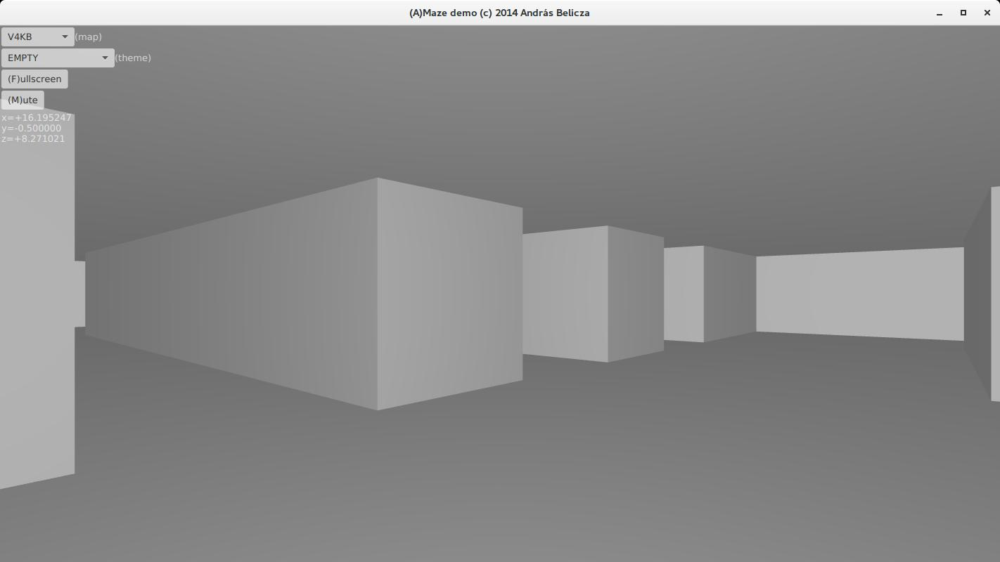

# Amaze

Amaze is a 3D labyrinth demo written using JavaFX

## Features

- Configurable maps

- Themes (different set of textures)

- Controls: moving (up, down), turning (left, right), change elevation (space, enter),
look up / down (insert / del), stride (page up, home)

- Switches on the wall

- Fullscreen mode

- Creepy background sound effect

## Screenshots

## Status

The demo was developed in April, 2014. It is not developed anymore.
